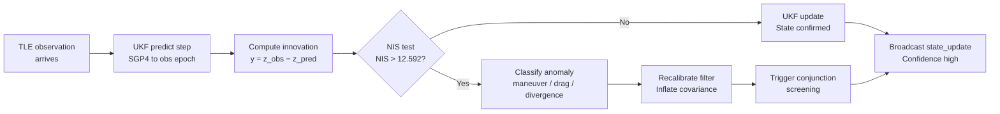
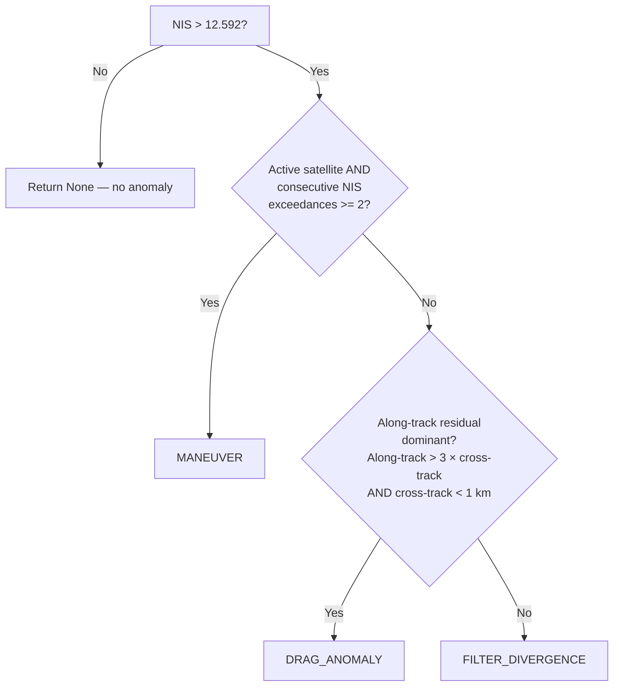
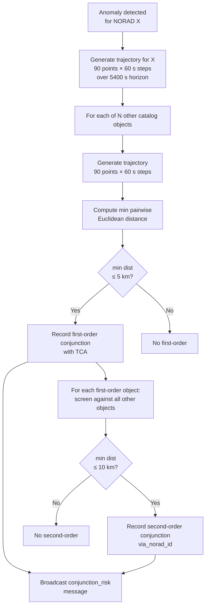

# Algorithmic Foundation and Novel Contribution
Version: 0.1.0
Status: Draft
Last updated: 2026-03-30

---

## Overview

This document describes the mathematical and algorithmic basis of the n-body Space Situational Awareness (SSA) platform, and establishes its novel contribution relative to the current state of the art in orbital tracking, anomaly detection, and conjunction assessment. It is the primary technical merit document for SBIR reviewers and AFS technical evaluators. The document is grounded entirely in the implemented system: all formulas, parameters, constants, and thresholds are drawn directly from source code and engineering records. Claims of novelty are bounded to what the proof-of-concept demonstrates; the production path is clearly distinguished from the POC.

---

## Context

The n-body platform implements a closed-loop, continuous orbital state estimation system using a per-object Unscented Kalman Filter (UKF) driven by SGP4-propagated TLE observations. The architectural concept — replacing static long-horizon prediction with a recursive estimation loop — is described in `docs/architecture.md` Section 2 and the CONOPS in `docs/reference/conops.md`. This document provides the mathematical depth required to evaluate that concept on technical merit.

The primary pipeline is:

```
Space-Track.org → ingest.py → propagator.py → kalman.py → anomaly.py → main.py → Browser
```

Every component at the algorithmic center of this pipeline — the UKF predict/update cycle, the NIS consistency test, the three-way anomaly classifier, the conjunction screening cascade, and the confidence estimator — is described in sufficient detail for independent reproduction.

---

## Definitions

| Term | Definition |
|------|------------|
| TLE | Two-Line Element set. Compact orbital mean-element format published by 18th SDS via Space-Track.org. Serves as both state seed and synthetic observation in this system. |
| SGP4 | Simplified General Perturbations 4 (Vallado implementation). Analytic propagator that converts TLE mean elements to an ECI state vector at a target epoch. |
| ECI J2000 | Earth-Centered Inertial reference frame, J2000 epoch. All internal state vectors use this frame in km and km/s. The implementation uses GCRS as a J2000 equivalent (sub-meter error for LEO; see TD-003). |
| UKF | Unscented Kalman Filter. Nonlinear recursive state estimator. Propagates uncertainty through a set of sigma points rather than linearizing the dynamics Jacobian. |
| State vector | 6-element vector `[x_km, y_km, z_km, vx_km_s, vy_km_s, vz_km_s]` in ECI J2000. |
| Innovation (residual) | `y = z_observed − z_predicted`: difference between the TLE-derived observation and the filter's prior prediction at the same epoch. |
| NIS | Normalized Innovation Squared. `NIS = yᵀ S⁻¹ y` where S is the innovation covariance. Under a consistent filter, NIS is chi-squared distributed with degrees of freedom equal to the state dimension. |
| Q | Process noise covariance matrix. Encodes uncertainty in unmodeled forces between observations. |
| R | Measurement noise covariance matrix. Encodes uncertainty in the TLE-derived state observation. |
| P | State error covariance matrix. Encodes the filter's current uncertainty in its state estimate. |
| CHI2_THRESHOLD_6DOF | 12.592. The chi-squared critical value for 6 degrees of freedom at p=0.05. The NIS anomaly detection threshold. |
| Recalibration | Re-initialization of the filter state from a new observation with inflated covariance, triggered on anomaly detection. |
| Conjunction | Predicted close approach between two tracked objects within the screening volume. |
| Lyapunov instability | Exponential sensitivity of orbital trajectory predictions to initial condition error. The fundamental mathematical reason long-horizon prediction degrades. |
| TEME | True Equator Mean Equinox. The native output frame of the SGP4 algorithm. Rotated to GCRS/J2000 via astropy before entering the filter. |

---

## Detailed Description

### 1. Problem statement: Lyapunov instability and the failure of static prediction

The fundamental limit of traditional SSA is not computational but mathematical. Low-Earth orbital dynamics are described by a nonlinear ODE system with a positive Lyapunov exponent: small perturbations in initial conditions — atmospheric drag variations, solar radiation pressure, unannounced maneuvers — grow exponentially with time. A TLE that is accurate to 100 meters at its epoch can degrade to kilometer-level position error within hours for actively maneuvering or drag-affected objects in LEO.

The standard response has been to publish updated TLEs more frequently and improve propagator fidelity. Both approaches have diminishing returns. More frequent TLEs reduce the integration horizon but do not eliminate the instability. Higher-fidelity propagators (numerical integrators with full atmospheric and radiation models) reduce systematic error but cannot model unannounced maneuvers or real-time atmospheric density variations.

The n-body platform does not attempt to solve the long-horizon prediction problem. Instead, it reframes it: the question changes from "how accurately can we predict position in 72 hours?" to "how quickly can we detect that our current prediction is wrong and correct it?" This is a control systems reframing. The orbit is the plant; TLE updates are noisy sensor measurements; the UKF is the estimator; anomaly detection is the alarm. The system's metric of merit is detection latency, not prediction accuracy.

### 2. Prior art limitations

#### 2.1 18th Space Defense Squadron static catalog

The operational baseline for LEO catalog maintenance is the 18th Space Defense Squadron (18th SDS) catalog, accessible via Space-Track.org. This system uses batch orbit determination — fitting TLE mean elements to radar observations — and publishes updated TLEs periodically. From the consumer's perspective, each TLE is a static snapshot. There is no published consistency check between successive TLEs for a given object. An operator using Space-Track data directly has no automated signal that a newly published TLE is anomalously inconsistent with the prior one. Detection of maneuvers or drag events requires manual analyst comparison of successive ephemerides.

#### 2.2 LeoLabs

LeoLabs operates a proprietary phased-array radar network optimized for LEO tracking. Its data product is a high-accuracy object catalog with regular updates. The technical differentiation of LeoLabs is sensor quality — higher-precision radar returns, more frequent observations for high-value objects — not filter architecture. The LeoLabs API provides state vectors and covariance estimates per observation pass. What it does not provide is a continuous closed-loop estimator that persists between observations, computes innovation residuals against a prior prediction, and autonomously classifies anomalies. Detection of maneuvers in the LeoLabs product requires analyst review of state changes across successive passes.

#### 2.3 Slingshot Aerospace

Slingshot Aerospace is a visualization-centric SSA platform. Its Beacon product aggregates observations from multiple sensor networks and provides an operator-facing web interface for tracking, conjunction assessment, and space traffic coordination. The platform's value is data fusion and operator workflow, not algorithmic novelty in the estimation layer. Closed-loop recursive state estimation with automated anomaly classification is not a feature of the current Slingshot product.

#### 2.4 ExoAnalytic Solutions

ExoAnalytic Solutions operates a network of commercial telescopes focused on geosynchronous and highly elliptical orbits. Its catalog augmentation product contributes optical detections to the unclassified catalog for deep-space objects underrepresented in radar-based catalogs. The approach is observation-centric rather than estimation-centric. Continuous filter states, NIS-based divergence detection, and real-time recalibration are not described in ExoAnalytic's published product documentation.

#### 2.5 AGI/Ansys STK

Systems Tool Kit (STK) from Ansys (formerly AGI) is the industry standard for orbital simulation and analysis. STK provides high-fidelity propagation, conjunction assessment, coverage analysis, and mission planning. It is an analyst-driven simulation tool, not a continuous monitoring platform. STK does not maintain persistent filter states between analyst sessions, does not autonomously detect TLE-to-TLE inconsistencies, and does not classify anomalies in real time. Using STK for continuous monitoring would require an analyst to manually configure and run analysis scenarios on each new TLE publication — precisely the manual workflow the n-body platform automates.

#### 2.6 Academic orbit determination

Sequential orbit determination using Kalman or batch least-squares filters has a long academic history (Montenbruck & Gill, Vallado, Tapley et al.). These methods are well understood and routinely applied in precision orbit determination for missions with dedicated tracking assets. The gap is not algorithmic knowledge but operational deployment: academic OD software (GMAT, Orekit) is configured per-mission, per-analyst, and per-session. It is not deployed as a continuous monitoring service that maintains persistent filter states for a large heterogeneous catalog, classifies anomalies automatically, integrates conjunction screening into the anomaly detection loop, and exposes results to operators in a browser-based visualization within seconds. The n-body platform is not a novel algorithm — the UKF is established. The novel contribution is the operational architecture: the integration of the UKF into a continuous closed-loop monitoring service with automated anomaly classification, conjunction coupling, and real-time operator interface.

### 3. The n-body approach: from prediction accuracy to detection latency

The core architectural reframing is captured in the observation-propagate-validate-recalibrate loop (see `docs/architecture.md` Section 2):



Every TLE publication serves two roles simultaneously: it is a new observation that updates the filter state, and it is a test of whether the previous filter state was consistent with the object's actual behavior. When the two roles are in tension — when the new observation is inconsistent with what the filter predicted — the system detects the inconsistency autonomously, characterizes it, and corrects.

The analogy to feedback control is exact. The filter is a closed-loop estimator. The TLE arrival rate (once per 30 minutes per object) determines the observation bandwidth. The filter's innovation covariance bounds determine the alarm sensitivity. Detection latency is bounded above by one observation interval (30 minutes) plus filter processing time (under 100 ms per object, NF-001). This is the fundamental metric advantage over static prediction, where detection latency is bounded below by the time between analyst review sessions.

### 4. UKF formulation

#### 4.1 State vector and coordinate frame

The state vector is 6-dimensional:

```
x = [x_km, y_km, z_km, vx_km_s, vy_km_s, vz_km_s]
```

All values are in Earth-Centered Inertial (ECI) J2000 coordinates. Position units are kilometers; velocity units are km/s. The implementation uses GCRS as a J2000 equivalent, introducing a sub-meter approximation for LEO objects (TD-003). The TEME-to-GCRS rotation is performed via astropy's IAU precession/nutation model on every SGP4 propagation call (`propagator._teme_to_eci_j2000`). All downstream computation — the UKF filter state, the innovation vector, the covariance matrices, the NIS statistic, and WebSocket message payloads — remain in ECI J2000. Coordinate conversion to ECEF or geodetic occurs only at the API boundary.

Initial state covariance P0 is diagonal, with 100 km² position variance and 0.01 (km/s)² velocity variance (10 km position uncertainty, 0.1 km/s velocity uncertainty at 1-sigma). This is inflated during recalibration by a scalar factor (see Section 4.6).

#### 4.2 Sigma point parameterization

The UKF uses the Merwe Scaled Sigma Point scheme via FilterPy's `MerweScaledSigmaPoints`:

- `n = 6` (state dimension)
- `alpha = 1e-3` (sigma point spread; controls distance from the mean)
- `beta = 2.0` (optimal for Gaussian distributions)
- `kappa = 0.0` (secondary scaling parameter)

This generates `2n + 1 = 13` sigma points per predict/update cycle.

#### 4.3 Process model: SGP4 as deterministic trajectory propagator

The UKF process model (`fx`) propagates the state from the previous observation epoch to the current observation epoch. The process model is SGP4, invoked via `propagator.tle_to_state_vector_eci_km`:

```python
def _fx_sgp4(x: NDArray, dt: float) -> NDArray:
    return propagator.tle_to_state_vector_eci_km(tle_line1, tle_line2, target_epoch_utc)
```

**Known limitation (TD-007, POST-002):** SGP4 is a deterministic trajectory model parameterized by TLE mean elements — it is not a force-model ODE. All 13 sigma points therefore produce identical outputs because SGP4 does not accept an arbitrary initial state vector; it uses the TLE elements regardless of the sigma point offset. The practical consequence is that covariance growth in the predict step is driven entirely by the process noise matrix Q rather than by sigma-point divergence through nonlinear dynamics. This is a named POC simplification. The production fix (POST-003) is replacement with a numerical integrator (RK4 with J2/J3 geopotential, NRLMSISE-00 drag, solar radiation pressure) so each sigma point propagates independently from its perturbed initial condition, restoring proper covariance propagation.

Despite this limitation, the predict-plus-Q formulation is sufficient to maintain reasonable uncertainty bounds for the POC demonstration, because the dominant uncertainty source for 30-minute update intervals is the unmodeled force environment (captured by Q), not sigma-point divergence through SGP4's analytic trajectory.

#### 4.4 Measurement model: full-state identity observation

The measurement function is the identity:

```python
def _identity_hx(state_eci_km: NDArray) -> NDArray:
    return state_eci_km
```

This reflects the POC's use of TLE-derived state vectors as direct observations of the full ECI state. There is no partial observability in this formulation — the "sensor" provides the complete 6-dimensional position-velocity vector at each TLE epoch. The observation is constructed by calling `propagator.propagate_tle(tle_line1, tle_line2, obs_epoch_utc)`, which runs SGP4 and rotates the output from TEME to GCRS/J2000.

**Simulation fidelity boundary:** This is the most significant simplification in the POC. Real sensors — radar, optical, Space Fence — produce partial observations (angles, range, Doppler), not full 6-element state vectors. Treating TLE-derived states as observations conflates the batch OD process that produced the TLE with a direct measurement. The `ingest.py` → `kalman.py` boundary is clearly documented so reviewers understand this approximation. The measurement noise matrix R (Section 4.5) reflects TLE accuracy rather than actual sensor noise.

#### 4.5 Process noise matrix Q

Three Q matrices are defined per object class (`kalman.OBJECT_CLASS_Q`). All are diagonal, in km² (position) and (km/s)² (velocity):

**Debris** (`OBJECT_CLASS_DEBRIS`):
```
Q_debris = diag([1.0, 1.0, 1.0, 1e-4, 1e-4, 1e-4])
```
Position sigma: ~1 km. Velocity sigma: ~0.01 km/s. Higher drag uncertainty reflects debris objects' high area-to-mass ratios and unpredictable atmospheric interaction. No maneuver capability modeled.

**Active satellite** (`OBJECT_CLASS_ACTIVE`):
```
Q_active = diag([0.25, 0.25, 0.25, 25e-4, 25e-4, 25e-4])
```
Position sigma: ~0.5 km. Velocity sigma: ~0.05 km/s. Moderate position uncertainty with elevated velocity uncertainty to accommodate maneuver probability. The higher velocity variance is the principal mechanism enabling maneuver detection: an unmodeled delta-V primarily appears as a velocity residual before propagating into a position residual.

**Rocket body** (`OBJECT_CLASS_ROCKET_BODY`):
```
Q_rocket = diag([0.5625, 0.5625, 0.5625, 4e-4, 4e-4, 4e-4])
```
Position sigma: ~0.75 km. Velocity sigma: ~0.02 km/s. Intermediate values reflecting higher drag uncertainty than active satellites (larger, tumbling objects) but no maneuver capability.

These matrices are hand-tuned for the POC (TD-006). The physical interpretation is that each diagonal entry represents the variance in unmodeled acceleration accumulated over a 30-minute update interval, integrated into position and velocity uncertainty. The production replacement is an adaptive process noise estimator (SAGE-Holt method or innovation-based covariance estimation, POST-002) that adjusts Q online to maintain filter consistency as measured by the NIS history.

#### 4.6 Measurement noise matrix R: calibration against ISS TLE accuracy

The default measurement noise matrix is (`kalman.DEFAULT_R`):
```
R = diag([900.0, 900.0, 900.0, 2e-3, 2e-3, 2e-3])
```
Units: km² (position diagonal), (km/s)² (velocity diagonal).

The 900 km² position variance corresponds to a 1-sigma TLE position uncertainty of 30 km. The 2e-3 (km/s)² velocity variance corresponds to a 1-sigma velocity uncertainty of approximately 0.045 km/s.

**Empirical calibration rationale:** These values were calibrated against the measured ISS (NORAD 25544) TLE-to-TLE prediction error. When the filter was initialized with tighter R values (e.g., 1.0 km² position variance, implying a claimed 1 km TLE accuracy), every normal 30-minute TLE update produced NIS far above the 12.592 threshold, resulting in perpetual spurious recalibration. The 30 km 1-sigma figure is consistent with published literature on Space-Track TLE accuracy for LEO objects in active drag regimes (Vallado, Crawford 2008). Space-Track TLEs are produced by fitting radar observations from the ground-based sensor network; the resulting mean elements can deviate from true position by tens of kilometers for objects in high-drag or maneuvering regimes.

**Consequence for detection threshold:** A delta-V event that shifts the ISS orbit by at least the equivalent of ~30 km in position (propagated from the maneuver epoch to the next TLE epoch) will produce NIS above the detection threshold. In practice, the effective maneuver detection threshold for synthetic injection is approximately 5.0 m/s delta-V at the 30-minute TLE update rate, using along-track injection (the direction that maximally perturbs the next observation). Values below approximately 2.0 m/s do not consistently exceed the NIS threshold under current calibration. This calibration is a POC artifact. A production system using higher-accuracy sensor observations would calibrate R to the actual sensor noise, enabling detection of much smaller events.

The R matrix is diagonal; off-diagonal position-velocity correlations are neglected in the POC. A production implementation would use a full 6×6 R matrix populated from empirical TLE accuracy studies or sensor-specific noise characterization.

#### 4.7 NIS computation and the chi-squared consistency test

The Normalized Innovation Squared is computed after each UKF update step (`kalman.compute_nis`):

```
NIS = yᵀ S⁻¹ y
```

where:
- `y` is the 6-element innovation vector (observed state minus predicted state at the observation epoch)
- `S` is the 6×6 innovation covariance matrix, computed by FilterPy during the UKF update as `S = H P Hᵀ + R`

Under a consistent filter — one whose process and measurement noise models accurately reflect the true noise — NIS is a chi-squared random variable with 6 degrees of freedom. The expected value is 6; the 95th percentile is 12.592. When NIS exceeds 12.592, the observation is inconsistent with the filter's prediction at the 5% significance level.

The threshold constant is defined once in `kalman.py` and imported by `anomaly.py`:
```python
CHI2_THRESHOLD_6DOF: float = 12.592  # chi-squared, 6 DOF, p=0.05
```

If the innovation covariance S is rank-deficient (which should not occur when Q and R are positive definite, but is guarded against), the implementation falls back to the Moore-Penrose pseudoinverse with a warning (TD-009). In production this branch should trigger filter recalibration rather than proceeding with a numerically incorrect NIS.

The NIS history is maintained as a rolling window of the last 20 values per object (`kalman.update`). The window size is hard-coded and not currently configurable (TD-010). At the 30-minute update rate, 20 values cover 10 hours of history.

### 5. Anomaly detection and classification

#### 5.1 Detection trigger

Anomaly detection is triggered whenever `NIS > CHI2_THRESHOLD_6DOF` (`anomaly.evaluate_nis`). The test is strict: NIS must strictly exceed 12.592, not merely equal it. This is implemented as:

```python
return nis > threshold
```

No minimum anomaly duration or de-bouncing is applied at the detection layer. Classification (Section 5.2) applies additional temporal requirements for the maneuver class only.

#### 5.2 Three-way classification

`anomaly.classify_anomaly` applies three rules in priority order. The first match determines the classification:



**Rule 1 — MANEUVER:** The object's catalog entry must be `object_class = active_satellite`, and the NIS must have exceeded the threshold for at least `MANEUVER_CONSECUTIVE_CYCLES = 2` consecutive update cycles. Consecutive cycles are counted from the tail of the NIS history list (`anomaly._count_consecutive_tail_exceedances`). The inflation factor for a maneuver recalibration is 20.0 (large covariance inflation reflecting that the orbit has physically changed).

**Conflict note (TD-012):** `architecture.md` Section 3.4 states maneuver detection requires ">3 consecutive update cycles." The implemented value is `MANEUVER_CONSECUTIVE_CYCLES = 2` (F-032). This document reflects the implemented behavior. The architecture document predates the implementation and has not been updated.

**Rule 2 — DRAG_ANOMALY:** The velocity residual direction is used as a proxy for the along-track direction (ECI simplification — see TD-011). The position residual is decomposed into along-track and cross-track components relative to this proxy. If the along-track component exceeds three times the cross-track component, and the cross-track component is less than 1 km, the event is classified as a drag anomaly. This heuristic distinguishes systematic along-track force model errors (atmospheric density mismatch, unmodeled drag) from isotropic force events. The inflation factor is 10.0.

**Known limitation (TD-011):** Using the velocity residual direction as a proxy for the along-track orbital direction is an ECI simplification. A correct drag anomaly classification requires decomposing the innovation into the RSW (Radial-Along-Cross) frame using the object's actual ECI velocity vector from the filter state. The residual velocity direction and the true orbital velocity can differ significantly, particularly for high-inclination orbits or objects with non-negligible eccentricity. The production fix is RSW frame decomposition using `filter_state["state_eci_km"][3:6]` as the along-track reference.

**Rule 3 — FILTER_DIVERGENCE:** All remaining NIS exceedances that do not satisfy the maneuver or drag anomaly conditions are classified as filter divergence. This is the catch-all category. The inflation factor is 10.0, identical to drag anomaly.

#### 5.3 Recalibration strategy

`kalman.recalibrate` re-initializes the filter from the current observation with inflated covariance:

```python
def recalibrate(filter_state, new_observation_eci_km, epoch_utc, inflation_factor=10.0):
    new_state = init_filter(
        state_eci_km=new_observation_eci_km,
        epoch_utc=epoch_utc,
        process_noise_q=filter_state["q_matrix"],
        measurement_noise_r=filter_state["r_matrix"],
    )
    new_state["filter"].P = _make_default_covariance_p0(inflation_factor)
    new_state["nis_history"] = filter_state["nis_history"].copy()  # preserve for classification
    return new_state
```

Inflation factors by anomaly type:
- `maneuver`: 20.0 — large inflation because the orbit has physically changed; the prior state is discarded
- `drag_anomaly`: 10.0 — moderate inflation for atmospheric model mismatch
- `filter_divergence`: 10.0 — default inflation for unclassified divergence

The inflated covariance (100 km² × inflation factor) is explicitly visible in the browser visualization as a larger uncertainty ellipsoid immediately after recalibration, which then narrows as subsequent TLE updates are incorporated. This visual narrative is the "recalibration arc" in the demo scenario.

The NIS history is preserved across recalibration so that `classify_anomaly` can examine the pre-recalibration NIS pattern for the next update cycle if needed. The new filter state is initialized from the current TLE-derived observation, which is the best available estimate of the post-event orbital state.

### 6. Conjunction screening

#### 6.1 Algorithm structure

Conjunction screening is triggered automatically when an anomaly is detected (`main.py` via `asyncio.create_task` + `run_in_executor`). The screening is CPU-bound and runs in a thread pool executor to avoid blocking the FastAPI event loop. The algorithm is implemented in `conjunction.screen_conjunctions`.



#### 6.2 Trajectory generation and screening parameters

Each trajectory consists of 90 position points propagated at 60-second steps over a 5400-second (90-minute) horizon (`conjunction.SCREENING_HORIZON_S = 5400`, `conjunction.SCREENING_STEP_S = 60`). The 90-minute horizon covers approximately one full orbital period for ISS-altitude LEO objects (~400 km altitude, ~92-minute period).

Trajectory generation calls `propagator.propagate_tle` for each step, returning `(epoch_utc, position_eci_km)` tuples. Only the 3-element position vector is used in screening; velocity is discarded. Steps that fail SGP4 propagation are skipped with a warning rather than aborting the entire trajectory.

Miss distance is computed as the minimum Euclidean distance (spherical, not RSW) between co-epoch trajectory pairs:
```
min_distance_km = min over t { |position_A(t) - position_B(t)| }
```

This is an O(N) linear scan over the 90 time steps, with N trajectories evaluated against the anomalous object's trajectory.

#### 6.3 First-order and second-order cascade

First-order threshold: 5 km (`conjunction.FIRST_ORDER_THRESHOLD_KM`). Any object whose minimum trajectory distance to the anomalous object is ≤ 5 km within the 90-minute horizon is flagged as a first-order conjunction risk.

Second-order threshold: 10 km (`conjunction.SECOND_ORDER_THRESHOLD_KM`). Each first-order object's trajectory is then screened against all remaining catalog objects (excluding the anomalous object). Any object within 10 km of a first-order object is flagged as a second-order risk, with a `via_norad_id` field identifying the first-order intermediary. Duplicate (norad_id, via_norad_id) pairs are suppressed.

The second-order cascade models the conjunction risk propagation scenario: an anomalous object (maneuvering or diverged) may create new collision risks for objects that were not previously at risk relative to each other, because the anomalous object's new trajectory passes close to a first-order object, which in turn may be close to a third object.

#### 6.4 Computational cost and limitations

At 100 catalog objects, conjunction screening requires 100 × 90 = 9,000 SGP4 + TEME-to-GCRS propagation calls. At 5–10 ms per call, total screening time is approximately 45–90 seconds (TD-029). This is acceptable for a demonstration with one anomaly event at a time; the screening runs non-blocking via `asyncio.run_in_executor`.

**Known limitation (TD-027):** The current screening uses spherical miss distance. The DoD/NASA standard uses an asymmetric RSW pizza-box screening volume (1 km radial × 25 km along-track × 25 km cross-track). The spherical volume produces more false positives for objects in similar orbital planes, where along-track separation is large but radial and cross-track separation is small. The production fix is RSW frame decomposition at the Time of Closest Approach (TCA) and application of asymmetric thresholds.

### 7. Confidence score

`kalman.compute_confidence` computes a heuristic scalar in [0, 1] from the current NIS value and the rolling NIS history:

```python
# History score: fraction of recent NIS values at or below threshold
history_score = below_threshold_count / len(nis_history)  # 1.0 if all within bounds

# Current NIS score: linear map from [0, 2 × threshold] to [1, 0]
current_score = max(0.0, 1.0 - (nis / (2.0 × CHI2_THRESHOLD_6DOF)))

# Weighted blend: current NIS weighted 2× vs. history average
confidence = (2.0 × current_score + history_score) / 3.0
```

Confidence values map to three operator-visible states:
- Green: confidence > 0.85 (F-051)
- Amber: 0.60 ≤ confidence ≤ 0.85
- Red: confidence < 0.60

**Known limitation (TD-008):** The confidence formula is a heuristic linear blend, not a rigorous statistical quantity. A more principled approach would use the chi-squared CDF directly: `confidence = 1 - scipy.stats.chi2.cdf(nis, df=6)`, which maps NIS to its p-value. The heuristic was chosen because it can be calibrated directly against the three frontend color thresholds without requiring the reviewer to interpret p-values. Post-POC, replacement with the CDF-based formula will improve statistical rigor and interpretability.

The NIS history window is the last 20 updates per object (TD-010). At the 30-minute poll interval, this covers the most recent 10 hours. History score drops immediately when a NIS exceedance occurs and recovers as subsequent updates fall within the threshold.

### 8. Validation evidence

#### 8.1 Real-world event 1: ISS autonomous detection, 2026-03-29 03:11 UTC

On 2026-03-29 at 03:11:03 UTC, the system autonomously detected an anomaly on ISS (ZARYA, NORAD 25544):

- **NIS at detection:** 247.2 (threshold: 12.592; ratio: 19.6×)
- **Peak residual:** 383 km
- **Classification:** `filter_divergence`
- **Resolution:** Recalibrated successfully within approximately 2 observation cycles
- **Status at detection time:** First autonomous real-world detection; not scripted or seeded

The classification as `filter_divergence` rather than `maneuver` reflects the single-cycle NIS exceedance: the ISS is an active satellite, but `MANEUVER_CONSECUTIVE_CYCLES = 2` requires at least two consecutive above-threshold NIS values, and the TLE update immediately following the event registered the exceedance only once before recalibration. This is an open issue under investigation (see Open Questions, OQ-03). The detection itself — a NIS of 247.2 on a nominal-magnitude update — is unambiguous regardless of classification.

**Circumstantial context (engineering log, not confirmed):** The 03:xx UTC detection window is consistent with Progress MS-33 reboost operations. Progress MS-33 docked 2026-03-24, carrying approximately 828 kg propellant. ISS periodically performs altitude maintenance reboosts. The timing and signature are consistent with a planned burn, but no corroboration from the public ISS operations schedule was available at the time of detection.

#### 8.2 Real-world event 2: ISS autonomous detection, 2026-03-30 03:57 UTC

On 2026-03-30 at 03:57:49 UTC, a second autonomous detection fired on the same object:

- **NIS at detection:** 722.4 (threshold: 12.592; ratio: 57.4×)
- **Peak residual:** 648.215 km
- **Classification:** `filter_divergence`
- **Resolution:** RESOLVED — confidence returned to 100.0%
- **Status:** Second consecutive night, same ~03:xx UTC window; consistent with a paired reboost sequence

| Metric | 2026-03-29 | 2026-03-30 | Delta |
|--------|-----------|-----------|-------|
| Time (UTC) | 03:11:03 | 03:57:49 | +46 min |
| NIS | 247.2 | 722.4 | +192% |
| Peak residual (km) | 383 | 648.215 | +69% |
| Classification | filter_divergence | filter_divergence | — |
| Outcome | Resolved | Resolved | — |

The NIS tripling between events is consistent with either a larger burn on the second night or the filter entering the second event with elevated uncertainty from the previous night's recalibration — both of which would increase the observed innovation magnitude. The consistent 03:xx UTC window across both nights is consistent with a ground station contact or orbital geometry constraint governing burn scheduling.

These two events constitute the first multi-event autonomous real-world validation dataset for the system. Both were detected, classified, and resolved entirely by the filter without scripting, seeding, or analyst intervention.

**Open issue:** Both real-world events were classified as `filter_divergence` rather than `maneuver`. The `MANEUVER_CONSECUTIVE_CYCLES = 2` threshold requires NIS elevation on at least two consecutive TLE updates. The events produced single-cycle NIS exceedances that triggered recalibration before a second update could confirm the elevated state. Whether this represents a threshold calibration issue or a structural limitation of using TLE updates as observations (at 30-minute resolution, a reboost burn may be entirely captured in a single TLE delta) is under investigation. A plan to address maneuver classification fidelity is referenced in the Open Questions section.

#### 8.3 Synthetic maneuver injection validation

The maneuver injection script (`scripts/seed_maneuver.py --object 25544 --delta-v 5.0 --trigger`) applies a 5.0 m/s along-track delta-V to the ISS TLE, inserts the synthetic TLE into the SQLite cache, and triggers a processing cycle. The resulting NIS exceedance is reliably detectable under the current R calibration. The anomaly appears in the browser visualization within 10 seconds of script completion (NF-023). The uncertainty cone widens immediately after recalibration and narrows as subsequent updates converge — the recalibration arc is directly observable in the CesiumJS visualization.

For the demo, this sequence provides the "funding moment" contrast: the n-body system detects and classifies the maneuver autonomously; a static SGP4 propagation from the pre-maneuver TLE continues to extrapolate the pre-maneuver orbit indefinitely with no alert and no residual computation.

### 9. Production path

The following algorithmic improvements are identified for post-POC development, in priority order:

**POST-003 — High-fidelity numerical propagator.** Replace SGP4 with a numerical integrator (RK4 or RK45) incorporating J2–J6 zonal harmonics, NRLMSISE-00 atmospheric drag, and solar radiation pressure. This restores proper sigma-point divergence through nonlinear dynamics, enabling the UKF's covariance propagation to reflect true force-model uncertainty rather than the hand-tuned Q matrix.

**POST-002 — Adaptive process noise estimation.** Implement a SAGE-Holt or innovation-based adaptive Q estimator that adjusts the process noise matrix online based on observed NIS history. A consistent filter maintains NIS near the chi-squared mean of 6. NIS systematically above 6 indicates Q is too small (underestimating process noise); NIS systematically below 6 indicates Q is too large. Adaptive Q eliminates the manual tuning requirement and improves filter consistency across object classes and drag regimes.

**POST-001 — Multi-source sensor fusion.** Replace TLE-as-observation with real sensor observations: Space Fence (S-band radar, ~15 cm accuracy for LEO), commercial radar (LeoLabs, ExoAnalytic), optical networks. Each source contributes a partial observation (range, angles, Doppler) with a source-specific R matrix calibrated to its accuracy class. The UKF measurement model transitions from the identity (full-state observation) to a partial observation model requiring a non-trivial H matrix. This fundamentally improves detection sensitivity for small maneuvers and drag events.

**POST-004 — Probability of collision.** Replace spherical miss-distance conjunction screening with Monte Carlo Pc computation, sampling from the full 6×6 covariance distributions of both objects at the predicted Time of Closest Approach. This provides calibrated collision probability estimates rather than binary within-threshold flags.

**TD-027 — RSW conjunction screening volume.** Replace the spherical screening thresholds with the standard asymmetric RSW pizza-box (1 km radial × 25 km along-track × 25 km cross-track), reducing false positives for objects in similar orbital planes and aligning with the DoD/NASA operational screening standard.

---

## Constraints and Invariants

The following constraints must hold throughout all algorithmic operation. Violations will produce incorrect results without necessarily producing an error.

**ALG-01:** All state vectors passed to or from `kalman.py` functions are ECI J2000, 6-element, in km and km/s. The coordinate frame is enforced by convention and type; there is no runtime frame-check.

**ALG-02:** All timestamps passed to `kalman.predict`, `kalman.update`, and `kalman.recalibrate` must be UTC-aware `datetime` objects with `tzinfo` set. Naive datetimes raise `ValueError` at the function boundary.

**ALG-03:** `target_epoch_utc` in `kalman.predict` must be strictly after `filter_state["last_epoch_utc"]`. Zero or negative `dt_s` raises `ValueError`. The filter does not support backward propagation.

**ALG-04:** The NIS threshold `CHI2_THRESHOLD_6DOF = 12.592` is defined in `kalman.py` and imported by `anomaly.py`. There is a single definition. Tests and documentation must not hardcode an alternative value.

**ALG-05:** `anomaly.classify_anomaly` does not query the catalog database. The caller (`main.py`) is responsible for determining `is_active_satellite` from the catalog and passing it as a parameter. If the catalog lookup fails, pass `False` (conservative: cannot classify as maneuver without confirmation of object class).

**ALG-06:** `conjunction.screen_conjunctions` must be called via `asyncio.run_in_executor`; it is synchronous and CPU-bound. Direct `await` or call from the event loop will block all WebSocket clients for the duration of screening.

**ALG-07:** The inflation factor passed to `kalman.recalibrate` must be positive. An inflation factor of 1.0 produces the default P0; larger values produce wider initial uncertainty. The default inflation factors by anomaly type (20.0 for maneuver, 10.0 for drag and divergence) are set by `anomaly.trigger_recalibration` and must not be bypassed.

**ALG-08:** The SGP4 `WGS72` gravity model is used in `propagator.propagate_tle`. TLE elements are generated with WGS72 constants; using WGS84 would introduce a small but avoidable systematic error. Do not change the gravity model constant without regenerating the TLE catalog under the same model.

---

## Cross-references

- `backend/kalman.py` — UKF implementation, Q matrices, R matrix, NIS computation, confidence, recalibration
- `backend/propagator.py` — SGP4 propagation, TEME-to-GCRS frame conversion, `tle_epoch_utc`
- `backend/anomaly.py` — `classify_anomaly`, `trigger_recalibration`, `MANEUVER_CONSECUTIVE_CYCLES`, `evaluate_nis`
- `backend/conjunction.py` — `screen_conjunctions`, `generate_trajectory_eci_km`, `compute_min_distance_km`, screening constants
- `docs/architecture.md` — Sections 2 (architectural concept), 3.2 (propagator), 3.3 (Kalman filter), 3.4 (anomaly detection), 6 (scalability path)
- `docs/requirements.md` — F-020 through F-035 (filter and anomaly requirements), POST-001 through POST-004 (production requirements)
- `docs/tech-debt.md` — TD-003, TD-006, TD-007, TD-008, TD-009, TD-010, TD-011, TD-012, TD-027, TD-029
- `docs/ENGINEERING_LOG.md` — real-world ISS event records (2026-03-29 and 2026-03-30)
- `docs/reference/conops.md` — operational context, demo walkthrough, value proposition narrative

---

## Known Limitations

**ALG-LIM-001: SGP4 sigma point collapse (TD-007, POST-002).** All 13 UKF sigma points produce identical process model outputs because SGP4 is a TLE-parameterized trajectory model, not an initial-condition ODE. UKF covariance propagation in the predict step is therefore driven entirely by Q, not by sigma-point divergence. This is a structural limitation of using SGP4 as the UKF process model. Production fix: numerical integrator (POST-003).

**ALG-LIM-002: Hand-tuned process noise Q (TD-006).** The three Q matrices are calibrated by physical intuition and ad hoc filter tuning, not by empirical NIS analysis or an adaptive algorithm. Q values that work for the POC demonstration may be suboptimal for specific objects, drag regimes, or orbital altitudes. Production fix: adaptive Q via SAGE-Holt or innovation-based estimation (POST-002).

**ALG-LIM-003: TLE as observation (simulation fidelity boundary).** The POC uses TLE-derived full-state vectors as filter observations. Real sensors provide partial observations (angles, range, Doppler) at higher rates. The R matrix reflects TLE accuracy (~30 km 1-sigma), not sensor accuracy. This sets the maneuver detection sensitivity floor at approximately 5 m/s delta-V for the demo. A production system with real sensor observations would have materially higher detection sensitivity.

**ALG-LIM-004: GCRS used as J2000 (TD-003).** The TEME-to-GCRS astropy transform is used as a J2000 equivalent. Residual error is up to ~20 milliarcseconds (~sub-meter for LEO). This is negligible relative to the R matrix calibration but is not mathematically exact J2000. Production fix: apply the ICRS-to-FK5 frame-tie rotation matrix after the GCRS transform.

**ALG-LIM-005: Drag anomaly ECI approximation (TD-011).** The along-track proxy used in drag anomaly classification is the ECI velocity residual direction, not the RSW-derived along-track unit vector. This approximation may misclassify events for high-inclination or eccentric orbits. Production fix: RSW frame decomposition.

**ALG-LIM-006: Spherical conjunction screening (TD-027).** The 5 km / 10 km spherical miss-distance thresholds produce false positives for objects in similar orbital planes with large along-track but small radial/cross-track separation. Production fix: RSW pizza-box screening volume.

**ALG-LIM-007: Real-world events classified as filter_divergence, not maneuver.** Both autonomous ISS detections (2026-03-29 and 2026-03-30) were classified as `filter_divergence` despite strong circumstantial evidence for reboost maneuvers. The `MANEUVER_CONSECUTIVE_CYCLES = 2` threshold requires two consecutive above-threshold TLE updates; single-cycle events default to `filter_divergence`. This represents a known calibration issue for events at the 30-minute TLE update rate. Investigation is ongoing.

**ALG-LIM-008: Confidence formula is heuristic (TD-008).** The confidence score uses a weighted linear blend of current NIS and recent history, not a rigorous chi-squared CDF mapping. The formula is calibrated against the three frontend color thresholds and is not directly interpretable as a probability. Production fix: replace with `1 - scipy.stats.chi2.cdf(nis, df=6)`.

---

## Open Questions

**OQ-01: Maneuver classification threshold calibration.** The `MANEUVER_CONSECUTIVE_CYCLES = 2` threshold failed to produce `maneuver` classifications for both real-world ISS reboost events, which were single-cycle NIS exceedances. Should the threshold be reduced to 1 for operational utility, or is the two-cycle requirement appropriate given the false-positive risk? A plan to address maneuver classification fidelity has been initiated (`docs/plans/2026-03-30-maneuver-classification-fix.md` — status at time of writing: not yet created). This question must be resolved before the classification system can be presented as validated.

**OQ-02: R matrix calibration per object class.** The current `DEFAULT_R` is a single matrix applied to all object classes. High-accuracy active satellites (ISS, Hubble) may have tighter TLE accuracy than debris or rocket bodies. Should R be differentiated per object class, analogous to Q? Separate R matrices would improve NIS calibration but would require per-class empirical TLE accuracy data.

**OQ-03: Detection sensitivity under stale TLE cache.** For demo presentations that run offline from a pre-cached 72-hour TLE set, the natural NIS baseline may be elevated due to TLE age (older TLEs are less accurate). The 5.0 m/s synthetic injection threshold may need adjustment for stale-cache demos. A characterization of baseline NIS as a function of TLE age has not been performed.

**OQ-04: NIS history window size.** The 20-entry rolling history window covers 10 hours at the 30-minute poll rate. For objects with slow-developing anomalies (gradual drag increase), a longer window may improve history-score accuracy. For rapidly evolving events, a shorter window is more responsive. A sensitivity analysis on window size has not been performed.
