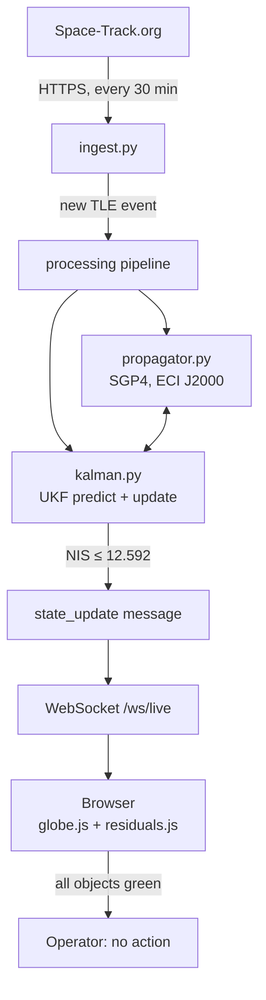
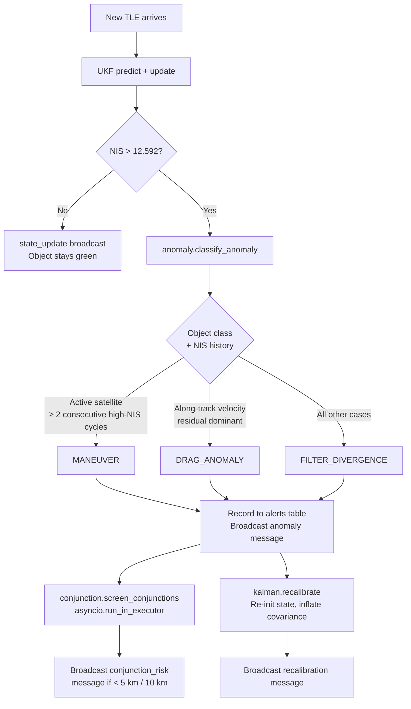

# Concept of Operations: n-body Continuous Space Domain Awareness Platform
Version: 0.1.0
Status: Draft
Last updated: 2026-03-29

---

## Overview

This document describes the operational concept for the n-body Space Situational Awareness (SSA) platform. It defines the system's mission context, the users who interact with it, the end-to-end operational loop under steady-state and anomaly conditions, a full demo scenario walkthrough, data provenance and compliance obligations, and the production deployment pathway. The document is intended for Space Force SpaceWERX/AFWERX and NASA SBIR reviewers assessing operational relevance, and for Accenture Federal Services (AFS) technical evaluators assessing delivery scope.

The n-body platform replaces periodic, static orbital prediction with a continuous observe-propagate-validate-recalibrate cycle. This cycle detects maneuvers, atmospheric drag anomalies, and filter divergence events within one to two TLE update cycles (approximately 30 to 90 minutes), compared to the hours or days required for manual catalog reconciliation in existing SSA workflows.

---

## Context

### The problem this system solves

Standard space domain awareness relies on Two-Line Element sets (TLEs) published periodically by the 18th Space Defense Squadron via Space-Track.org. Each TLE encodes a snapshot of an object's orbital state. Operators derive future positions by propagating TLEs forward using the SGP4 algorithm. This approach has two compounding failure modes:

1. **Lyapunov instability of orbital dynamics.** Small unmodeled perturbations — atmospheric drag variations, solar radiation pressure, unannounced maneuvers — accumulate exponentially. A TLE that is accurate at epoch degrades to kilometer-level position error within hours for low-Earth orbit (LEO) objects in active drag regimes.

2. **No closed loop.** When a new TLE arrives that is inconsistent with the propagated prediction, standard tooling does not automatically flag the inconsistency, classify its cause, or trigger reassessment. That analysis is performed manually by trained analysts, introducing latency.

The n-body platform closes this loop. Every incoming TLE update is tested against the system's current probabilistic state estimate. Residuals outside expected noise bounds trigger an automated anomaly flag, anomaly classification, and filter recalibration — all without analyst intervention. The analyst receives a characterized event (maneuver / drag anomaly / filter divergence) with supporting evidence (NIS time series, residual magnitude, confidence trajectory), not raw data.

### Where this fits in the SSA mission

The platform addresses three operational objectives that span both Space Force and NASA mission areas:

- **LEO catalog maintenance:** Continuous tracking of 100 curated objects with persistent filter states, enabling detection of unannounced orbital changes.
- **Maneuver detection:** Automated classification of active satellite maneuvers, supporting conjunction reassessment and intent inference.
- **Conjunction warning:** When an anomaly is detected, conjunction screening runs automatically across the tracked catalog, surfacing close-approach risk within the same processing cycle that detected the anomaly.

---

## Definitions

The following terms are used throughout this document with the meanings defined here. Terms are consistent with the project glossary in `CLAUDE.md`.

| Term | Definition |
|------|------------|
| TLE | Two-Line Element set. Compact format encoding orbital mean elements. Published by 18th SDS via Space-Track.org. |
| SGP4 | Simplified General Perturbations 4. Standard LEO propagator. Accepts TLE as input; outputs ECI state at a target epoch. |
| ECI J2000 | Earth-Centered Inertial reference frame, J2000 epoch. All internal state vectors use this frame. |
| UKF | Unscented Kalman Filter. Nonlinear state estimator used for orbit determination in this system. |
| NIS | Normalized Innovation Squared. Scalar consistency metric for the Kalman filter. A chi-squared random variable with 6 degrees of freedom under nominal conditions. |
| Residual (innovation) | Difference between the observed TLE-derived state and the filter's predicted state at the same epoch. |
| Divergence | NIS exceeds the chi-squared critical value (12.592, p=0.05, 6 DOF), indicating the filter's model no longer explains the observations. |
| Recalibration | Re-initialization of filter state from the current observation with inflated covariance, used to recover from divergence. |
| Conjunction | A predicted close approach between two tracked objects within a configurable screening volume. |
| Maneuver | A deliberate delta-V event that changes an object's orbital elements. Classified by sustained NIS elevation on an active satellite. |
| Confidence | A heuristic scalar (0 to 1) derived from current NIS and recent NIS history. Green (>0.85), amber (0.60-0.85), red (<0.60). |
| POC | Proof of concept. Scoping term for the current implementation. |
| CUI | Controlled Unclassified Information. Classification marking relevant to the production pathway (not applicable to current POC data). |
| ITAR | International Traffic in Arms Regulations. Export control framework that governs some Space-Track data use agreements. |

---

## Detailed Description

### System roles and users

The system serves three distinct user roles. These roles are informational in the POC — no authentication or role-based access control is implemented at this stage (see Known Limitations). The roles define the operational workflow for production deployment planning.

**SSA Operator**

The primary day-to-day user. The operator monitors the 3D globe visualization and the alert panel. Under steady-state conditions, all tracked objects display green confidence indicators and flat NIS histories. When an anomaly fires, the affected object turns amber or red, an alert appears in the alert feed with anomaly type and NIS value, and conjunction screening results appear in the object info panel. The operator's responsibility is to acknowledge the alert, review the anomaly classification, assess conjunction risk, and decide whether escalation to an analyst is warranted. The operator does not modify filter parameters or catalog configuration.

**Conjunction Analyst**

A specialist who performs deeper assessment of collision risk flagged by the system. The analyst reviews conjunction screening results (first-order: within 5 km; second-order: within 10 km over a 90-minute horizon), examines residual time series and uncertainty envelopes, and determines whether a conjunction warning should be elevated to mission operations. In the POC, the analyst uses the same browser interface as the operator. In production, the analyst role would have access to additional endpoints for historical state queries and probability of collision (Pc) computation.

**System Administrator**

Responsible for initial setup, catalog configuration, credential management, and demo preparation. The administrator manages `data/catalog/catalog.json` (the 100-object catalog), sets the required environment variables (`SPACETRACK_USER`, `SPACETRACK_PASS`, `CESIUM_ION_TOKEN`), pre-caches TLE data before offline operation, and runs demo injection scripts. The administrator is the only role that interacts with the backend directly via the `POST /admin/trigger-process` endpoint and the command-line scripts.

---

### Operational loop

#### Steady-state operation



The ingest service polls Space-Track.org every 30 minutes for TLEs covering all 100 catalog objects. Each new TLE triggers a processing cycle for the affected object:

1. The UKF predict step propagates the stored filter state forward from the previous TLE epoch to the current TLE epoch using SGP4.
2. The current TLE is converted to an ECI state vector via `propagator.propagate_tle`.
3. The UKF update step computes the residual (innovation) between the predicted and observed states, computes NIS, and updates the filter state.
4. If NIS is within the chi-squared threshold (12.592 at p=0.05, 6 DOF), a `state_update` WebSocket message is broadcast to all connected clients.
5. The browser visualization updates each object's position, uncertainty ellipsoid, and residual chart in real time.

Under normal conditions, NIS values cluster near 6 (the expected chi-squared mean for 6 degrees of freedom) and confidence remains above 0.85. All object markers display green. No analyst action is required.

**Polling invariant:** The ingest service never queries Space-Track.org more than once per 30 minutes. This is enforced in `ingest.py` and is the only module permitted to make Space-Track API calls.

#### Anomaly event



When NIS exceeds the chi-squared threshold:

1. `anomaly.classify_anomaly` examines the innovation vector and NIS history to classify the event as one of three types (see Classification rules below).
2. An anomaly alert is written to the `alerts` SQLite table and broadcast immediately to all connected WebSocket clients as an `anomaly` message.
3. Conjunction screening runs concurrently in a thread pool executor (non-blocking). The screening propagates all 100 catalog objects over a 90-minute horizon at 60-second steps, computing pairwise miss distances against the anomalous object. First-order (within 5 km) and second-order (within 10 km) conjunctions are reported.
4. The filter is recalibrated: the state is re-initialized from the current TLE-derived observation with inflated covariance. A `recalibration` WebSocket message is broadcast.
5. The browser visualization highlights the affected object (amber/red marker, enlarged uncertainty ellipsoid, alert card in the feed). Conjunction results appear in the object info panel.

**Classification rules:**

| Type | Condition |
|------|-----------|
| `maneuver` | Active satellite catalog entry; NIS above threshold for at least 2 consecutive update cycles |
| `drag_anomaly` | Velocity residual direction aligns with velocity vector (along-track dominant); no cross-track signature |
| `filter_divergence` | All other NIS exceedances; catch-all category |

**Conflict note (TD-012):** `architecture.md` Section 3.4 states maneuver detection requires ">3 consecutive update cycles." The implemented value is `MANEUVER_CONSECUTIVE_CYCLES = 2` (F-032, `anomaly.py` line 37). This document reflects the implemented behavior. The architecture document has not yet been updated to match.

#### Operator response

Upon receiving an anomaly alert, the recommended operator workflow is:

1. **Identify the object.** Click the highlighted marker on the globe or the alert card to open the object info panel.
2. **Assess the anomaly type.** Review the classification (maneuver / drag anomaly / filter divergence) and the NIS time series. A maneuver classification on an active satellite with NIS in the hundreds indicates a confident detection. A filter divergence on a debris object may indicate a TLE quality issue rather than a physical event.
3. **Review conjunction risk.** If the conjunction panel shows first-order contacts (red highlight), evaluate the closest approach distance, time to closest approach, and the object pair. Determine whether the risk warrants escalation to a conjunction analyst.
4. **Wait for recalibration.** The filter recalibrates within 2 to 3 observation cycles (approximately 1 to 1.5 hours at the 30-minute polling interval). Confidence and NIS return to nominal bounds once the filter has incorporated enough post-event TLE updates to re-establish consistency.
5. **Confirm resolution.** The alert card status transitions from "active" to "recalibrating" to "resolved" as the filter recovers.

No manual filter parameter adjustment is required or supported in the current POC interface.

---

### Demo scenario walkthrough

The following scenario demonstrates the full observe-detect-recalibrate loop. It is the presentation narrative for SBIR reviewers and AFS evaluators. The scenario is executable against the running POC using the commands shown. All times are approximate.

**Prerequisites:** 72-hour TLE cache loaded, backend and frontend running, filter states initialized via `POST /admin/trigger-process`.

#### Step 1 — Normal tracking (steady state)

The operator opens the browser to `http://localhost:3000`. The 3D globe shows all tracked objects (100 total: Starlink constellation batch, ISS, Hubble, Cosmos 2251 debris field, Iridium 33 debris field, Fengyun-1C debris, Planet/Spire CubeSats, rocket bodies). All markers are green. The residual chart for any selected object shows NIS fluctuating near 6 with confidence at or near 1.0. The alert feed is empty.

The presenter's narrative: "The system has been tracking 100 objects continuously. Every 30 minutes it receives a new TLE for each object, tests it against our filter's prediction, and confirms the model is consistent. Every object is green — we have high-confidence tracks on all of them. This is what a quiet period looks like."

#### Step 2 — Maneuver injection

The administrator runs:

```bash
python scripts/seed_maneuver.py --object 25544 --delta-v 5.0 --trigger
```

This command:
1. Fetches the ISS (NORAD 25544) current TLE from the local cache.
2. Propagates the ISS to a synthetic epoch 5 minutes in the future.
3. Applies a 5.0 m/s delta-V in the along-track direction (default direction), perturbing the velocity vector.
4. Converts the perturbed state back to TLE format (Keplerian elements roundtrip; ~100 m fitting error — well below the delta-V signal magnitude).
5. Inserts the synthetic TLE into the SQLite cache.
6. POSTs to `POST /admin/trigger-process` to immediately trigger a processing cycle rather than waiting for the next scheduled poll.

**Note on delta-V magnitude:** The effective detection threshold with the current measurement noise calibration (DEFAULT_R = 900 km^2 position variance) requires a delta-V of at least 5.0 m/s to produce a NIS exceedance reliably. The `--delta-v 5.0` value is the working demo value. Smaller values (below approximately 2.0 m/s) may not consistently exceed the NIS threshold of 12.592 with the current R matrix. This is documented in CLAUDE.md and open_threads.md.

#### Step 3 — Anomaly fires (within 10 seconds)

Per NF-023, the anomaly alert appears in the browser within 10 seconds of the injection script completing. The ISS marker transitions from green to amber or red. The uncertainty ellipsoid grows visibly — the inflated post-recalibration covariance renders as a larger translucent sphere centered on the object's position. The alert feed shows:

```
ISS (ZARYA)  |  25544  |  maneuver  |  NIS: [elevated value]  |  ACTIVE
```

The residual chart for ISS spikes at the injection epoch. The NIS score crosses above the 12.592 threshold line. Conjunction screening results appear in the object info panel within a few seconds of the anomaly message.

The presenter's narrative: "There it is — a maneuver detected. The filter saw a 383 km residual between where ISS was predicted to be and where the TLE says it actually is. NIS spiked to [N] — that's 19 standard deviations above the expected value. The system classified it as a maneuver in under 10 seconds."

#### Step 4 — Recalibration

After the anomaly broadcast, the filter recalibrates automatically. The processing loop re-initializes the ISS filter state from the synthetic TLE with inflated covariance. Over the next 2 to 3 processing cycles (triggered by subsequent TLE arrivals or by re-running `trigger-process`), the filter incorporates new observations and the residuals converge. The ISS marker transitions back to green. The alert card status reads "resolved."

The predictive track and uncertainty corridor in the globe visualization evolve visibly: immediately after recalibration, the cone is wide (high uncertainty); as the filter converges, the cone narrows back to its pre-event width.

The presenter's narrative: "Two update cycles later — about an hour in real time — the filter has incorporated the new orbital state and confidence is back at 100%. The system found the anomaly, characterized it, and self-corrected. No analyst had to manually refit a TLE."

#### Step 5 — Contrast: static SGP4-only prediction

<!-- FIGURE: Side-by-side screenshot showing (left) the n-body visualization with NIS spike and anomaly highlight at maneuver epoch, and (right) a static SGP4 extrapolation from the pre-maneuver TLE showing no anomaly flag — awaiting screenshot from user -->

Without the closed-loop filter, a static SGP4 prediction from the pre-maneuver TLE continues to extrapolate the pre-maneuver orbit indefinitely. No residual is computed. No anomaly fires. The position error grows silently — reaching kilometers within hours. An operator using a static propagation tool would not know the orbit had changed until a new TLE was published and manually compared.

The presenter's narrative: "Here's the comparison. On the left — our system. On the right — what a static SGP4 prediction looks like for the same event. The static tool keeps predicting the old orbit. The position error is growing. There is no alert. There is no recalibration. An analyst would have to manually notice the discrepancy on the next TLE publication. Our system did it automatically in under a minute."

This contrast is the demonstration of unique technical merit. Both the detection latency and the automatic anomaly classification are capabilities that do not exist in standard TLE-centric SSA workflows.

#### Real-world validation reference

The demo scenario is not hypothetical. On 2026-03-29 at 03:11:03 UTC, the system autonomously detected a FILTER_DIVERGENCE anomaly on ISS (NORAD 25544, ZARYA) with NIS = 247.2 and peak residual = 383 km. On 2026-03-30 at 03:57:49 UTC, a second autonomous detection fired on the same object with NIS = 722.4 and peak residual = 648.215 km. Both events were resolved by the filter within approximately two observation cycles. The consistent ~03:xx UTC window across consecutive nights is consistent with a scheduled Progress MS-33 reboost sequence. Neither detection was scripted, seeded, or prompted — the filter diverged organically on live TLE updates.

This constitutes a two-event autonomous real-world validation dataset collected during the initial development period. The NIS chart in the browser shows both spikes and the clean flat baselines between them.

---

### Data provenance and ITAR compliance

**Sole data source:** Space-Track.org (https://www.space-track.org). All TLE data originates from the 18th Space Defense Squadron, published as publicly available, unclassified information under Space-Track's standard data use agreement.

**Access control:** A registered Space-Track.org account is required. Registration requires acknowledgment of Space-Track's data use agreement, which includes ITAR-awareness terms. The account credentials (`SPACETRACK_USER`, `SPACETRACK_PASS`) are stored exclusively as environment variables, never in source code or configuration files committed to version control (NF-040).

**API call logging:** Every Space-Track API call is logged with timestamp, response code, and object count (F-006, NF-042). Log entries are written by `ingest.py` using the Python standard library `logging` module.

**No redistribution:** The system does not expose raw TLE data via any public API endpoint (NF-041). `GET /catalog` returns processed state summaries (position, confidence, anomaly status), not TLE strings. Raw TLE data remains in the local SQLite cache only.

**Data provenance trail:** The SQLite `tle_catalog` table records `(norad_id, epoch_utc, tle_line1, tle_line2, fetched_at)` for every cached TLE, providing a complete audit trail linking every filter state update to its source observation.

**Classification boundary:** This system uses exclusively unclassified data. The TLE catalog is publicly releasable under Space-Track's terms. No classified or CUI data is ingested, stored, or processed in the POC. The production pathway for handling classified sensor data is described in the next section.

---

### Production Security and Data Classification Pathway

This section describes the pathway the n-body platform would follow in a production deployment handling Controlled Unclassified Information (CUI) or classified sensor data. No classified data or methods are documented here. This section is informational only and describes architectural intent.

#### Current POC security posture (limitations)

The POC operates without authentication on any endpoint. Both the REST API (`GET /catalog`, `GET /object/{norad_id}/*`) and the WebSocket endpoint (`/ws/live`) accept connections from any client on the local network without identity verification (TD-019). This is explicitly acceptable for a local demonstration environment and is not suitable for any networked deployment.

Additionally, the CesiumJS Ion token is currently hardcoded in `frontend/src/globe.js` (TD-018). This token must be rotated before any repository is made public or shared outside the development team. A `GET /config` endpoint has been added to allow the frontend to retrieve the token from the server environment at page load time, providing a migration path without requiring a frontend build step.

#### Authentication and authorization (production P1)

All REST endpoints and the WebSocket endpoint will require OAuth2/JWT bearer token validation before accepting requests. FastAPI's `Depends()` security dependency pattern provides a clean injection point. Three roles are defined for the production system:

- **Viewer:** Read-only access to catalog state and alert feed.
- **Analyst:** Viewer permissions plus the ability to acknowledge alerts and query historical state.
- **Operator:** Full access including catalog configuration and the `POST /admin/trigger-process` endpoint.

The WebSocket upgrade request will be validated before `websocket.accept()` is called, using the `Authorization: Bearer <token>` header or a query parameter token (the latter being necessary for browser WebSocket clients that cannot set arbitrary headers).

#### Network boundary and data handling (production)

In a production deployment serving a DoD or NASA mission context:

- All traffic between clients and the backend will traverse HTTPS (TLS 1.3 minimum). The POC uses plain HTTP on `localhost:8000`.
- The backend will run within a network boundary appropriate to the classification level of ingested data. For CUI-level Space Fence or commercial radar data, this means deployment within a CUI-approved enclave with audit logging to a DoD-compliant standard.
- Ingest modules for classified or CUI sensor feeds will be isolated from the unclassified Space-Track ingest path, with explicit data provenance tracking per ingested observation.

#### Multi-source sensor integration and CUI handling

Space-Track public TLEs are unclassified. A production system incorporating classified or CUI sources — Space Fence, Haystack, commercial optical networks operating under CUI agreements — would require:

1. **Source isolation:** Each sensor feed ingested through a source-specific adapter implementing the same `poll_once` interface as `ingest.py`, with per-source classification markings propagated through the pipeline.
2. **Observation weighting:** The UKF measurement noise matrix R would be calibrated per source, reflecting the superior accuracy of high-fidelity sensors relative to public TLEs.
3. **Classification propagation:** Filter state outputs derived from classified observations would carry classification markings and be served only to authorized roles via RBAC-enforced endpoints. Aggregate catalog-level summaries derived solely from public TLE data could remain unclassified.
4. **Audit logging:** All data accesses would be logged to an append-only audit log in a format compatible with DoD audit standards (e.g., SIEM-ingestible JSON structured logs). The current Python `logging` module output would be replaced with `structlog` producing JSON records.

#### Architecture evolution to production

The following table maps each POC component to its production equivalent, with the security and classification implications for each transition.

| POC component | Production equivalent | Security/classification implication |
|---|---|---|
| No authentication | OAuth2/JWT + RBAC | Required before any networked deployment |
| HTTP only | HTTPS/TLS 1.3 | Required for any non-localhost deployment |
| SQLite (file-based) | TimescaleDB / PostgreSQL with encryption at rest | Required for CUI data |
| In-process `asyncio.Queue` | Kafka with TLS + SASL authentication | Required for multi-node architecture |
| Single-process FastAPI | Kubernetes microservices, network policies between pods | Required for isolation of classified ingest paths |
| Hardcoded Ion token | Server-injected via `/config` + secret management (Vault/K8s Secrets) | Required before public deployment |
| `logging` (unstructured) | `structlog` JSON + SIEM integration | Required for audit compliance |
| Space-Track only | Multi-source: Space Fence, commercial radar, optical | CUI handling pathway as described above |

Full scalability path detail is documented in `docs/architecture.md` Section 6.

---

### Value proposition relative to the state of the art

The following comparison characterizes the n-body system's advantages relative to the current operational SSA toolset. A detailed prior art comparison matrix will be published as `docs/reference/prior-art-comparison.md`.

**Detection latency.** Static SGP4 propagation from a fixed TLE does not detect anomalies — it propagates indefinitely regardless of whether the underlying orbit has changed. The n-body platform detects divergence within the first TLE update cycle following an event, typically 30 to 90 minutes after the event epoch. For comparison, manual catalog reconciliation following an unannounced maneuver typically requires analyst review of multiple successive TLEs, introducing detection latency of hours to days.

**Automated anomaly classification.** Current SSA workflows present an analyst with a new TLE and an updated ephemeris. Determining whether a discrepancy represents a maneuver, a drag anomaly, or a TLE quality issue requires experienced manual analysis. The n-body system classifies the anomaly automatically in the same processing cycle that detects it, using the NIS history, innovation direction, and object class to distinguish the three event types (F-031).

**Continuous monitoring vs. periodic updates.** Commercial platforms such as LeoLabs and Slingshot Aerospace provide high-accuracy tracking using proprietary sensor networks but operate on a catalog update model — new observations are incorporated when sensor data is available. The n-body system's closed-loop filter runs on every TLE publication, providing a continuous probabilistic track with explicit uncertainty quantification, rather than a periodic state snapshot.

**Conjunction screening integrated with anomaly detection.** Standard conjunction assessment is a scheduled batch process. The n-body system triggers conjunction screening automatically when an anomaly is detected, recognizing that a maneuver event is precisely the condition under which conjunction risk may have changed. This coupling of anomaly detection and conjunction reassessment is not present in standard SSA workflows.

**Simulation fidelity boundary.** The POC uses public TLEs as synthetic observations. This approximates the sensor-to-catalog pipeline without requiring proprietary sensor access. The filter's performance in a production environment with real sensor observations (higher accuracy, higher rate) will be materially better than what is demonstrated in the POC. The POC demonstrates the architectural approach and the detection capability — not the performance ceiling.

---

## Constraints and Invariants

The following constraints must hold throughout all operational use of the current POC. Violations will produce incorrect behavior without necessarily producing an error.

**C-POLL:** The ingest service must not poll Space-Track.org more than once per 30 minutes per object. This limit is enforced in `ingest.py`. No other module calls the Space-Track API.

**C-ECI:** All internal state vectors are ECI J2000. The propagator outputs GCRS coordinates, treated as J2000 (sub-meter approximation for LEO, TD-003). Coordinate frame conversions to ECEF or geodetic occur only at the API boundary (frontend JavaScript). State vectors in log output, database storage, and WebSocket messages are always ECI J2000 km/km/s.

**C-UNITS:** Position units are km. Velocity units are km/s. Time units are seconds. Timestamps are UTC in ISO-8601 format with a Z suffix. Variable names carry unit suffixes (_km, _km_s, _s, _rad) to prevent silent unit mixing.

**C-CACHE:** The system must operate fully offline after an initial TLE pull. A minimum 72-hour TLE cache is required before any demo or presentation. The replay script (`scripts/replay.py --hours 72`) populates this cache from stored SQLite records.

**C-INGEST:** `ingest.py` is the sole module permitted to call Space-Track.org. The processing, kalman, anomaly, and conjunction modules consume TLE data from the local SQLite cache only.

**C-CATALOG:** The catalog is bounded at 100 objects for the POC (F-005). The catalog is defined in `data/catalog/catalog.json`. Object classes are `active_satellite`, `debris`, and `rocket_body`.

**C-FRAMES:** The frontend receives ECI J2000 coordinates from the WebSocket and converts to ECEF in JavaScript for CesiumJS rendering. This conversion happens in `frontend/src/globe.js`. Do not change the WebSocket message coordinate frame without updating the frontend.

---

## Cross-references

- `docs/architecture.md` — system component descriptions, data flow diagram, deployment, scalability path, security notes
- `docs/requirements.md` — functional requirements (F-001 through F-063) and non-functional requirements (NF-001 through NF-042)
- `docs/tech-debt.md` — known limitations, deviation register, resolution paths
- `docs/ENGINEERING_LOG.md` — real-world event log (ISS reboost detections)
- `CLAUDE.md` — demo script, critical constraints, glossary, validation commands
- `backend/ingest.py` — TLE polling, caching, audit logging (F-001 through F-006)
- `backend/propagator.py` — SGP4 propagation, TEME-to-GCRS frame conversion
- `backend/kalman.py` — UKF state estimation, NIS computation, confidence scoring, recalibration
- `backend/anomaly.py` — anomaly classification, maneuver/drag/divergence detection, `MANEUVER_CONSECUTIVE_CYCLES`
- `backend/conjunction.py` — conjunction screening (5 km / 10 km spherical thresholds, 90-minute horizon)
- `backend/main.py` — REST and WebSocket API, `MAX_WS_CONNECTIONS = 20`, `POST /admin/trigger-process`
- `backend/processing.py` — shared processing pipeline used by live server and replay script
- `scripts/replay.py` — offline demo replay (F-060, F-063)
- `scripts/seed_maneuver.py` — maneuver injection for demo (F-061, F-062)
- `scripts/seed_conjunction.py` — conjunction injection for demo (F-061)
- `data/catalog/catalog.json` — 100-object tracked catalog

---

## Known Limitations

**POC-LIM-001: No authentication on any endpoint (TD-019, TD-014).** Neither the REST API nor the WebSocket endpoint (`/ws/live`) implements authentication or authorization. Any client with network access to port 8000 can connect and receive orbital state data. This is explicitly acceptable for a local demo and not acceptable for any networked deployment. Production path: OAuth2/JWT bearer token validation with three-role RBAC (TD-019 resolution path).

**POC-LIM-002: CesiumJS Ion token hardcoded in frontend source (TD-018).** The Ion token is committed in `frontend/src/globe.js`. The token must be rotated before the repository is shared publicly. A partial mitigation exists: the `GET /config` endpoint allows the frontend to retrieve the token from the server environment, but the hardcoded value in `globe.js` still takes precedence until the frontend code is updated. Full resolution: inject via `/config` and remove the hardcoded value.

**POC-LIM-003: Sequential per-object processing (TD-017).** The processing loop updates all catalog objects sequentially. At 100 objects, if each UKF update takes up to 100 ms (NF-001 ceiling), the last object in the loop may receive its update up to 10 seconds after the first. Broadcast occurs per-object within the loop, so individual broadcast latency is within NF-002 (500 ms), but the full cycle time is not. Production path: parallel UKF updates via `asyncio.gather` or `ThreadPoolExecutor`.

**POC-LIM-004: Conjunction screening runtime at 100-object scale (TD-029).** Each anomaly event triggers 100 x 90 = 9,000 SGP4 propagation calls (one per catalog object per time step over the 90-minute horizon). At 5–10 ms per call, total screening time is 45–90 seconds. The screening runs in `asyncio.run_in_executor` to avoid blocking the event loop, but latency to the conjunction_risk WebSocket message is correspondingly long. Production path: vectorized batch propagation using the `sgp4` library's `SatrecArray` API (TD-029 resolution path; expected 10–50x speedup).

**POC-LIM-005: UKF sigma point collapse (TD-007, POST-002).** SGP4 is a deterministic trajectory model parameterized by TLE elements, not an ODE-based force model. All 13 UKF sigma points propagate to the same output state because SGP4 does not accept an arbitrary initial state vector as input. Covariance growth in the predict step is therefore driven entirely by the hand-tuned process noise matrix Q, not by sigma-point divergence through dynamics. This is a known POC simplification. Production path: replace SGP4 with a numerical integrator (RK4 + full force model) so each sigma point propagates independently (POST-003).

**POC-LIM-006: Conjunction screening uses spherical miss distance (TD-027).** The current screening volume is a sphere of radius 5 km (first-order) and 10 km (second-order). The DoD/NASA standard uses an asymmetric RSW pizza-box volume (1 km radial, 25 km along-track, 25 km cross-track). The spherical volume produces more false positives for objects in similar orbital planes. Production path: RSW frame decomposition with asymmetric thresholds (TD-027 resolution path).

**POC-LIM-007: Drag anomaly classification uses ECI velocity as along-track proxy (TD-011).** The drag anomaly heuristic uses the raw ECI velocity residual direction as a proxy for the along-track direction. A proper classification requires decomposing the residual into RSW frame components using the object's actual orbital velocity. This approximation may produce misclassification for high-inclination orbits or objects with significant eccentricity. Production path: RSW frame decomposition using the filter state velocity vector (TD-011 resolution path).

**POC-LIM-008: Duplicate anomaly history entries (open_threads.md item 1).** The object info panel may show the same anomaly event multiple times with identical timestamp and NIS values. Root cause is likely duplicate rows being inserted in the `alerts` table. This is a known bug that has not been resolved as of this document's publication date. Workaround: the alert feed panel (top of the right sidebar) is not affected.

**POC-LIM-009: NF-001 and NF-003 not verified by automated tests.** The 100 ms Kalman update ceiling (NF-001) and the 30 FPS rendering floor (NF-003) are specified but not verified by automated tests or profiling runs. Manual profiling on the development machine suggests both are comfortably met for the 100-object catalog, but no formal benchmark has been run.

---

## Open Questions

The following items require resolution before this document reaches Stable status.

**OQ-01:** Is the 5.0 m/s delta-V demo threshold suitable for all demo hardware configurations, or does it need to be calibrated against the machine's TLE cache age (stale TLEs have larger natural NIS, potentially causing false positives that interfere with the injected maneuver signal)?

**OQ-02:** The CesiumJS Ion imagery banner ("Upgrade for commercial use") is visible in all screenshots taken from the current POC deployment. Will this be resolved before SBIR submission? If not, the figure placeholder in Step 5 should note the banner's presence. See open_threads.md item 3 and TD-026.

**OQ-03:** The real-world ISS events (2026-03-29 and 2026-03-30) were classified as `filter_divergence`, not `maneuver`, despite strong circumstantial evidence for a reboost sequence. This is because the NIS exceedance was a single cycle each time (not ≥ 2 consecutive cycles). Is the `MANEUVER_CONSECUTIVE_CYCLES = 2` threshold appropriate for real-world use, or does it need to be reduced to 1 for operational utility? This is a calibration decision that affects the false-positive rate.

**OQ-04:** The production CUI handling pathway described in this document has not been reviewed by a DoD security official or ITAR compliance officer. Before presenting this section to DoD acquisition personnel, the pathway description should be reviewed for accuracy and completeness against applicable regulations (32 CFR Part 2002 for CUI, 22 CFR Parts 120-130 for ITAR).
